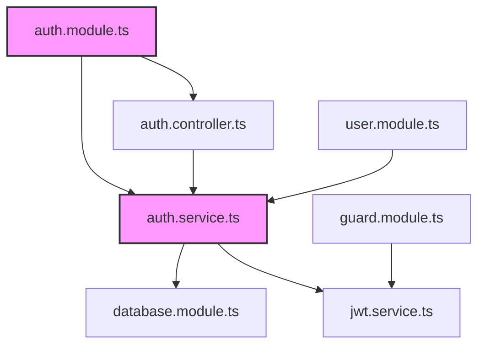

# context-management Plugin

대용량 코드베이스의 복잡성을 관리하고 개발 흐름을 최적화하는 지능형 컨텍스트 관리 시스템입니다. 토큰 한계를 극복하고 중요한 정보에 집중할 수 있도록 돕습니다.

## Core Philosophy

```
컨텍스트 관리 원칙:
├─ 정보 압축: 대용량 파일을 의미 있는 청크로 분할
├─ 관계 추출: 파일 간 의존성과 영향도 분석
├─ 스마트 필터링: 현재 작업에 관련된 정보만 선택
├─ 진행 상태 추적: 작업 컨텍스트와 상태 지속성 보장
└─ 인지 부하 최소화: 개발자가 집중해야 할 것에만 집중
```

## Architecture Overview

```
┌─────────────────────────────────────────────────────────────┐
│                Context Management Engine                    │
│                                                             │
│  Input Files ──► Semantic Analyzer ──► Context Graph        │
│       │               │                    │              │
│       ▼               ▼                    ▼              │
│  ┌─────────┐    ┌─────────────┐    ┌─────────────────┐     │
│  │ File    │    │ Dependency  │    │ Chunking        │     │
│  │ Scanner │    │ Extractor   │    │ Algorithm       │     │
│  └─────────┘    └─────────────┘    └─────────────────┘     │
│         │               │                    │               │
│         └───────────────┼────────────────────┘               │
│                         │                                   │
│                ┌────────▼─────────┐                         │
│                │  Context Store   │                         │
│  ┌─────────────┼──────────────────┼─────────────┐          │
│  │ Working     │  Relevance      │  History     │          │
│  │ Context     │  Scoring        │  Tracking    │          │
│  └─────────────┴──────────────────┴─────────────┘          │
└─────────────────────┬───────────────────────────────────────┘
                      │
                      ▼
┌─────────────────────────────────────────────────────────────┐
│                     Output                               │
│  • Focused Chunks   • Next Tasks   • Expert Routing       │
└─────────────────────────────────────────────────────────────┘
```

## Key Components

### 1. continue-context Command

**용도**: 현재 작업 상태를 분석하고 최적의 다음 단계를 추천

#### 분석 프로세스

```
CONTEXT ANALYSIS:
1. 현재 상태 파악
   ├─ Git 상태 (uncommitted changes, current branch)
   ├─ 열린 파일 및 에디터 상태
   ├─ 최근 명령어 히스토리
   └─ 오류 로그 및 경고

2. 패턴 인식
   ├─ 작업 유형 식별 (feature, bugfix, refactor)
   ├─ 영향 범위 계산
   ├─ 의존성 그래프 분석
   └─ 잠재적 문제 지점 예측

3. 다음 단계 추천
   ├─ 우선순위 기반 작업 정렬
   ├─ 관련 전문가 에이전트 매핑
   ├─ 자동화 가능한 작업 식별
   └─ 위험 요소 및 주의사항 제시

4. 실행 계획 생성
   ├─ 단계별 실행 목록
   ├─ 필요한 도구 및 명령어
   ├─ 예상 소요 시간
   └─ 성공 측정 기준
```

#### 사용 예시

```bash
# 기본 분석
/continue-context

# 특정 영역 집중
/continue-context authentication

# 배포 준비 상태 분석
/continue-context deployment
```

#### 결과물 예시

```json
{
  "current_state": {
    "branch": "feature/user-auth",
    "changes": 15,
    "uncommitted_files": ["src/auth/", "test/auth.spec.ts"],
    "last_action": "created JWT service"
  },
  "analysis": {
    "work_type": "feature_development",
    "completion_rate": 0.65,
    "blockers": [],
    "risks": ["missing tests", "security review needed"]
  },
  "recommendations": [
    {
      "action": "Write unit tests",
      "priority": "high",
      "agent": "suites-testing-expert",
      "command": "Generate tests for AuthService",
      "estimated_time": "15min"
    },
    {
      "action": "Security review",
      "priority": "high",
      "agent": "code-reviewer",
      "command": "Review auth module for vulnerabilities",
      "estimated_time": "10min"
    },
    {
      "action": "Update documentation",
      "priority": "medium",
      "agent": "document-builder",
      "command": "Document authentication flow",
      "estimated_time": "5min"
    }
  ],
  "next_steps": [
    "Run: /code-quality:review src/auth/",
    "Execute: test generation for AuthService",
    "Commit with message: 'feat: implement JWT authentication'"
  ]
}
```

### 2. inject-context Command

**용도**: 대용량 파일을 지능적으로 분할하고 관련 컨텍스트만 주입

#### 청킹 알고리즘

```
INTELLIGENT CHUNKING:
1. 구조 분석
   ├─ AST 파싱 (언어별 파서)
   ├─ 시맨틱 블록 식별
   ├─ 의존성 관계 매핑
   └─ 진입점 찾기

2. 청크 전략
   ├─ 의미론적 경계 따라 분할
   ├─ 상호 의존성 최소화
   ├─ 토큰 크기 최적화 (최대 8k 토큰)
   └─ 재사용 가능한 단위로 그룹화

3. 관련성 계산
   ├─ 현재 작업과의 연관도
   ├─ 변경 영향도 점수
   ├─ 중요도 가중치
   └─ 시간적 근접성

4. 선택적 주입
   ├─ 상위 N개 청크 선택
   ├─ 오버랩 영역 포함
   ├─ 필요한 컨텍스트만 전달
   └─ 메타데이터 첨부
```

#### 사용 예시

```bash
# 기본 파일 주입
/inject-context src/app.module.ts

# 태스크와 함께 주입
/inject-context src/database/ "데이터베이스 설정 최적화"

# 여러 파일 주입
/inject-context src/**/*.entity.ts "엔티티 관계 분석"

# 심층 분석 모드
/inject-context --deep src/user.service.ts
```

#### 청크 결과 예시

```json
{
  "file": "src/app.module.ts",
  "total_chunks": 4,
  "selected_chunks": 2,
  "chunks": [
    {
      "id": "chunk-1",
      "type": "imports",
      "relevance_score": 0.9,
      "content": "import { Module } from '@nestjs/common';...",
      "dependencies": ["ConfigModule", "DatabaseModule"],
      "token_count": 156
    },
    {
      "id": "chunk-2",
      "type": "module_definition",
      "relevance_score": 0.95,
      "content": "@Module({\n  imports: [...],\n  controllers: [...],...",
      "dependencies": ["UserController", "UserService"],
      "token_count": 289
    }
  ],
  "summary": {
    "primary_components": ["AppModule", "DatabaseModule"],
    "key_patterns": ["dependency_injection", "module_structure"],
    "suggestions": ["Consider splitting into feature modules"]
  }
}
```

## Advanced Features

### 1. Context Persistence

```yaml
# .claude/context-persistence.yml
storage:
  type: "file"  # file, redis, database
  path: ".claude/context/"
  ttl: "24h"

sessions:
  auto_save: true
  max_sessions: 10
  restore_on_startup: true

compression:
  enabled: true
  algorithm: "gzip"
  min_size: "1mb"
```

### 2. Smart Filtering

```typescript
// 컨텍스트 필터링 규칙
interface ContextFilter {
  // 파일 타입 기반
  fileTypes: {
    include: ["ts", "js", "py", "go"];
    exclude: ["test.ts", "spec.ts", ".d.ts"];
  };

  // 경로 기반
  paths: {
    include: ["src/**", "lib/**"];
    exclude: ["node_modules/**", "dist/**"];
  };

  // 크기 기반
  size: {
    max_file_size: "50kb";
    max_total_size: "1mb";
  };

  // 시간 기반
  time: {
    modified_within: "7d";
    accessed_within: "1d";
  };
}
```

### 3. Context Graph

의존성과 영향도를 시각화합니다.



### 4. Predictive Context

미래에 필요할 것으로 예측되는 컨텍스트를 미리 로드합니다.

```python
# 예측 로직 예시
def predict_context(current_file, task_history):
    """
    현재 파일과 작업 히스토리를 기반으로
    다음에 필요할 컨텍스트 예측
    """
    predictions = []

    # 1. 임포트 기반 예측
    imports = extract_imports(current_file)
    predictions.extend(find_related_files(imports))

    # 2. 작업 패턴 기반 예측
    pattern = analyze_task_pattern(task_history)
    predictions.extend(get_files_for_pattern(pattern))

    # 3. 동시 수정 파일 기반 예측
    concurrent = find_concurrent_edits(current_file)
    predictions.extend(concurrent)

    return rank_by_relevance(predictions)
```

## Performance Optimization

### 1. Lazy Loading

필요할 때만 컨텍스트를 로드합니다.

```javascript
// Lazy context loader
class ContextLoader {
  async loadContext(file, task) {
    // 1. 메타데이터만 먼저 로드
    const metadata = await this.getMetadata(file);

    // 2. 관련성 점수 계산
    const relevance = this.calculateRelevance(metadata, task);

    // 3. 높은 관련성일 경우에만 전체 로드
    if (relevance > THRESHOLD) {
      return await this.loadFullContent(file);
    }

    return null;
  }
}
```

### 2. Context Caching

```yaml
# .claude/context-cache.yml
cache:
  strategy: "lru"  # lru, lfu, fifo
  max_size: "100mb"
  ttl: "1h"

compression:
  enabled: true
  level: 6  # 1-9

invalidation:
  on_file_change: true
  on_dependency_update: true
  manual_purge: "/clear-context-cache"
```

### 3. Parallel Processing

```typescript
// 병렬 컨텍스트 분석
async function analyzeContext(files: string[]): Promise<ContextAnalysis> {
  // 파일 목록을 워커 수로 분할
  const chunks = chunkArray(files, WORKER_COUNT);

  // 병렬로 분석 실행
  const results = await Promise.all(
    chunks.map(chunk =>
      workerPool.execute('analyze', chunk)
    )
  );

  // 결과 병합
  return mergeAnalysisResults(results);
}
```

## Integration Patterns

### 1. IDE Integration

```json
// VS Code 확장 설정
{
  "contextManagement": {
    "autoAnalyze": true,
    "showSuggestions": true,
    "keybindings": {
      "analyzeContext": "ctrl+shift+a",
      "injectContext": "ctrl+shift+i"
    },
    " statusBar": {
      "showContextStatus": true,
      "showRecommendations": true
    }
  }
}
```

### 2. Git Hooks

```bash
#!/bin/sh
# .git/hooks/post-checkout
# 브랜치 변경 시 컨텍스트 자동 로드

/continue-context --branch $GIT_BRANCH

# .git/hooks/pre-commit
# 커밋 전 컨텍스트 분석

/continue-context --commit-prep
```

### 3. CI/CD Integration

```yaml
# .github/workflows/context-analysis.yml
name: Context Analysis

on:
  pull_request:
    types: [opened, synchronize]

jobs:
  analyze:
    runs-on: ubuntu-latest
    steps:
      - uses: actions/checkout@v3
      - name: Analyze context
        run: /continue-context --pr-analysis
      - name: Update PR with recommendations
        uses: actions/github-script@v6
        with:
          script: |
            const recommendations = require('./context-analysis.json');
            github.rest.issues.createComment({
              issue_number: context.issue.number,
              owner: context.repo.owner,
              repo: context.repo.repo,
              body: formatRecommendations(recommendations)
            });
```

## Best Practices

### 1. 컨텍스트 관리
- **작게 유지**: 한 번에 처리하는 컨텍스트는 3-5개 파일로
- **관련성 우선**: 현재 작업과 직접 관련된 것만
- **정기 정리**: 사용하지 않는 컨텍스트는 정기적으로 삭제
- **버전 관리**: 중요한 컨텍스트 상태는 저장

### 2. 청킹 전략
- **의미론적 경계**: 클래스, 함수, 모듈 단위로 분할
- **독립성**: 각 청크는 독립적으로 이해 가능해야 함
- **일관된 크기**: 각 청크는 비슷한 토큰 크기 유지
- **오버랩**: 중요한 경계는 약간의 오버랩 포함

### 3. 워크플로우 최적화
- **빠른 피드백**: 5초 이내에 분석 결과 제공
- **점진적 로딩**: 필요한 만큼만 점진적으로 로드
- **백그라운드 처리**: 대용량 분석은 백그라운드에서 실행
- **인터럽트 지원**: 긴 분석은 중간에 중단 가능

## Troubleshooting

### 일반적인 문제

#### 컨텍스트가 너무 클 때
```
문제: 토큰 초과 또는 응답 지연
원인: 너무 많은 파일을 한 번에 처리
해결:
1. 필터링 강화: /inject-context --filter "high-relevance"
2. 청크 크기 줄임: /inject-context --chunk-size 5000
3. 배치 처리: --batch 3
```

#### 관련성이 낮은 추천
```
문제: 다음 단계 추천의 정확도 낮음
원인: 작업 패턴 학습 부족
해결:
1. 피드백 제공: /continue-context --feedback "not-relevant"
2. 수동 힌트: /continue-context --hint "testing"
3. 히스토리 정리: /clear-context-history
```

[parent](../CLAUDE.md)