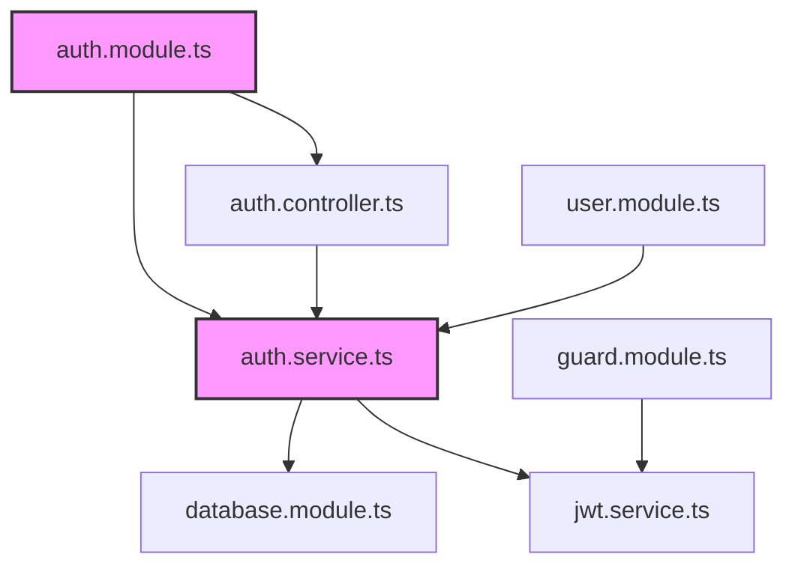

# Context Management 상세 가이드

이 문서는 context-management 플러그인의 청킹 전략, 컨텍스트 분석 알고리즘, 복구 패턴을 상세히 설명합니다.

## 목차

- [청킹 알고리즘](#청킹-알고리즘)
- [컨텍스트 분석 프로세스](#컨텍스트-분석-프로세스)
- [복구 패턴](#복구-패턴)
- [고급 기능](#고급-기능)

---

## 청킹 알고리즘

### 지능형 청킹 프로세스

```
INTELLIGENT CHUNKING:
1. 구조 분석
   ├─ AST 파싱 (언어별 파서)
   ├─ 시맨틱 블록 식별
   ├─ 의존성 관계 매핑
   └─ 진입점 찾기

2. 청크 전략
   ├─ 의미론적 경계 따라 분할
   ├─ 상호 의존성 최소화
   ├─ 토큰 크기 최적화 (최대 8k 토큰)
   └─ 재사용 가능한 단위로 그룹화

3. 관련성 계산
   ├─ 현재 작업과의 연관도
   ├─ 변경 영향도 점수
   ├─ 중요도 가중치
   └─ 시간적 근접성

4. 선택적 주입
   ├─ 상위 N개 청크 선택
   ├─ 오버랩 영역 포함
   ├─ 필요한 컨텍스트만 전달
   └─ 메타데이터 첨부
```

### 청킹 파라미터

| Parameter  | Value     | Rationale              |
| ---------- | --------- | ---------------------- |
| Chunk size | 800 lines | 원문 보존을 위해 최대화 |
| Overlap    | 20 lines  | 컨텍스트 연속성 유지   |
| Max chunks | 15        | 대용량 파일 지원       |
| Min chunk  | 50 lines  | 과도한 분할 방지       |

### 청킹 알고리즘 구현

```
ALGORITHM:
├─ IF TOTAL_LINES <= 800: single chunk (no split)
├─ ELSE: create chunks respecting BOUNDARIES
│
│   chunks = []
│   start = 1
│   WHILE start < TOTAL_LINES AND len(chunks) < MAX_CHUNKS:
│     target_end = start + CHUNK_SIZE - 1
│
│     # Find nearest boundary near target_end
│     boundary = nearest(BOUNDARIES, target_end, tolerance=50)
│     actual_end = boundary - 1 if boundary else target_end
│
│     chunks.append({start, actual_end})
│     start = actual_end - OVERLAP + 1
│   END WHILE
│
└─ IF remaining lines: add final chunk
```

### 언어별 구조 감지

```bash
EXT="${FILE_PATH##*.}"
case "$EXT" in
  py)     grep -n "^class \|^def \|^async def " "{FILE_PATH}" ;;
  ts|js)  grep -n "^export \|^class \|^function \|^const.*= " "{FILE_PATH}" ;;
  go)     grep -n "^func \|^type \|^package " "{FILE_PATH}" ;;
  rs)     grep -n "^pub \|^fn \|^struct \|^impl " "{FILE_PATH}" ;;
  java)   grep -n "^public \|^private \|^class \|^interface " "{FILE_PATH}" ;;
  md)     grep -n "^# \|^## \|^### " "{FILE_PATH}" ;;
  json)   grep -n '^\s*"[a-zA-Z]' "{FILE_PATH}" ;;
  yaml|yml) grep -n "^[a-zA-Z_-]\+:" "{FILE_PATH}" ;;
  toml)   grep -n "^\[" "{FILE_PATH}" ;;
  xml|html) grep -n "^<[a-zA-Z]" "{FILE_PATH}" ;;
  sql)    grep -n "^CREATE \|^ALTER \|^INSERT \|^SELECT " "{FILE_PATH}" ;;
  sh|bash) grep -n "^function \|^[a-zA-Z_]\+() " "{FILE_PATH}" ;;
  *)      grep -n "^$" "{FILE_PATH}" ;;
esac
```

---

## 컨텍스트 분석 프로세스

### 분석 단계

```
CONTEXT ANALYSIS:
1. 현재 상태 파악
   ├─ Git 상태 (uncommitted changes, current branch)
   ├─ 열린 파일 및 에디터 상태
   ├─ 최근 명령어 히스토리
   └─ 오류 로그 및 경고

2. 패턴 인식
   ├─ 작업 유형 식별 (feature, bugfix, refactor)
   ├─ 영향 범위 계산
   ├─ 의존성 그래프 분석
   └─ 잠재적 문제 지점 예측

3. 다음 단계 추천
   ├─ 우선순위 기반 작업 정렬
   ├─ 관련 전문가 에이전트 매핑
   ├─ 자동화 가능한 작업 식별
   └─ 위험 요소 및 주의사항 제시

4. 실행 계획 생성
   ├─ 단계별 실행 목록
   ├─ 필요한 도구 및 명령어
   ├─ 예상 소요 시간
   └─ 성공 측정 기준
```

### 컨텍스트 그래프

의존성과 영향도 시각화:



### 예측적 컨텍스트 로딩

미래에 필요할 것으로 예측되는 컨텍스트를 미리 로드:

```python
def predict_context(current_file, task_history):
    """
    현재 파일과 작업 히스토리를 기반으로
    다음에 필요할 컨텍스트 예측
    """
    predictions = []

    # 1. 임포트 기반 예측
    imports = extract_imports(current_file)
    predictions.extend(find_related_files(imports))

    # 2. 작업 패턴 기반 예측
    pattern = analyze_task_pattern(task_history)
    predictions.extend(get_files_for_pattern(pattern))

    # 3. 동시 수정 파일 기반 예측
    concurrent = find_concurrent_edits(current_file)
    predictions.extend(concurrent)

    return rank_by_relevance(predictions)
```

---

## 복구 패턴

### 작업 연속성 Decision Tree

```
DECISION LOGIC:

IF interrupted_task EXISTS:
    # 중단된 작업 자동 재개
    → "마지막 작업을 이어서 진행합니다: {interrupted_task}"
    → EXECUTE interrupted_task from break_point

ELIF explicit_next_step EXISTS:
    # 명시적 다음 단계 진행
    → "다음 단계를 진행합니다: {next_step}"
    → EXECUTE next_step

ELIF focus-area PROVIDED:
    # 사용자 지정 영역 작업
    → "'{focus-area}' 영역 작업을 진행합니다"
    → EXECUTE work on focus-area

ELIF logical_next_step INFERRED:
    # 논리적 다음 단계 추론
    → "논리적 다음 단계를 진행합니다: {inferred_step}"
    → EXECUTE inferred_step

ELSE:
    # 명확한 다음 단계 없음 - TUI로 선택
    → Show recommendation TUI
```

### 작업 연속 패턴

| 마지막 작업 | 논리적 다음 단계 |
|------------|-----------------|
| 코드 작성 완료 | 테스트 작성 → 커밋 |
| 분석 완료 | 구현 시작 |
| 테스트 실패 | 버그 수정 |
| 버그 수정 완료 | 테스트 재실행 → 커밋 |
| 리팩토링 완료 | 테스트 확인 → 커밋 |
| 파일 로드 완료 | 요청된 작업 수행 |
| 커밋 완료 | 푸시 또는 다음 작업 |
| PR 생성 완료 | 다음 기능 또는 종료 |

---

## 고급 기능

### 컨텍스트 지속성

```yaml
# .claude/context-persistence.yml
storage:
  type: "file"  # file, redis, database
  path: ".claude/context/"
  ttl: "24h"

sessions:
  auto_save: true
  max_sessions: 10
  restore_on_startup: true

compression:
  enabled: true
  algorithm: "gzip"
  min_size: "1mb"
```

### 스마트 필터링

```typescript
// 컨텍스트 필터링 규칙
interface ContextFilter {
  // 파일 타입 기반
  fileTypes: {
    include: ["ts", "js", "py", "go"];
    exclude: ["test.ts", "spec.ts", ".d.ts"];
  };

  // 경로 기반
  paths: {
    include: ["src/**", "lib/**"];
    exclude: ["node_modules/**", "dist/**"];
  };

  // 크기 기반
  size: {
    max_file_size: "50kb";
    max_total_size: "1mb";
  };

  // 시간 기반
  time: {
    modified_within: "7d";
    accessed_within: "1d";
  };
}
```

### Lazy Loading

```javascript
class ContextLoader {
  async loadContext(file, task) {
    // 1. 메타데이터만 먼저 로드
    const metadata = await this.getMetadata(file);

    // 2. 관련성 점수 계산
    const relevance = this.calculateRelevance(metadata, task);

    // 3. 높은 관련성일 경우에만 전체 로드
    if (relevance > THRESHOLD) {
      return await this.loadFullContent(file);
    }

    return null;
  }
}
```

### 병렬 처리

```typescript
async function analyzeContext(files: string[]): Promise<ContextAnalysis> {
  // 파일 목록을 워커 수로 분할
  const chunks = chunkArray(files, WORKER_COUNT);

  // 병렬로 분석 실행
  const results = await Promise.all(
    chunks.map(chunk =>
      workerPool.execute('analyze', chunk)
    )
  );

  // 결과 병합
  return mergeAnalysisResults(results);
}
```

---

[메인 문서](../CLAUDE.md) | [예제](examples.md) | [참고 자료](references.md)
