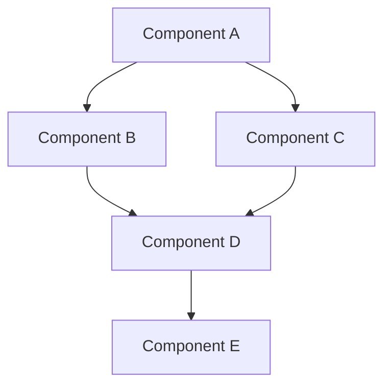

# Progressive Disclosure

> 계층적 문서 구조, 라인 제한, 네비게이션

## Overview

Progressive Disclosure 패턴을 통해 복잡한 정보를 단계적으로 제공합니다.

```
PROGRESSIVE DISCLOSURE HIERARCHY:
┌─────────────────────────────────────────────────────────┐
│ Level 1: Root CLAUDE.md (150 lines)                     │
│ ├─ 프로젝트 개요                                          │
│ ├─ 핵심 기능                                             │
│ ├─ Quick Start                                          │
│ └─ Links to Level 2 →                                   │
└───────────────────────┬─────────────────────────────────┘
                        │
        ┌───────────────┼───────────────┐
        ▼               ▼               ▼
┌──────────────┐ ┌──────────────┐ ┌──────────────┐
│ Level 2:     │ │ Level 2:     │ │ Level 2:     │
│ Plugin A     │ │ Plugin B     │ │ Plugin C     │
│ (80 lines)   │ │ (80 lines)   │ │ (80 lines)   │
│ ├─ 개요      │ │ ├─ 개요      │ │ ├─ 개요      │
│ └─ Links →   │ │ └─ Links →   │ │ └─ Links →   │
└──────┬───────┘ └──────┬───────┘ └──────┬───────┘
       │                │                │
       ▼                ▼                ▼
┌──────────────────────────────────────────────────────────┐
│ Level 3: agent-docs/ (Detailed, No Limit)               │
│ ├─ detailed-guides.md                                   │
│ ├─ examples.md                                          │
│ └─ references.md                                        │
└──────────────────────────────────────────────────────────┘
```

---

## 라인 제한 규칙

### 레벨별 제한

```
LINE LIMITS:
┌──────────────┬────────────┬───────────────────────────┐
│ 레벨          │ 최대 라인   │ 내용                       │
├──────────────┼────────────┼───────────────────────────┤
│ Root         │ 150        │ 전체 프로젝트 개요         │
│ Module       │ 80         │ 플러그인/모듈 개요         │
│ Submodule    │ 50         │ 컴포넌트 개요             │
│ Detailed     │ Unlimited  │ agent-docs/ 상세 문서     │
└──────────────┴────────────┴───────────────────────────┘

규칙:
- Frontmatter, 공백, 코드블록 모두 포함
- 초과 시 agent-docs/로 내용 분리
- 링크로 상세 문서 연결
```

### 제한 준수 전략

```
COMPLIANCE STRATEGIES:
├─ 우선순위 기반 내용 선택
│   1. 핵심 개요 (필수)
│   2. Quick Start (필수)
│   3. 주요 컴포넌트 (필수)
│   4. 상세 링크 (필수)
│   5. 예제 (선택)
│   6. 트러블슈팅 (agent-docs로)
│
├─ 압축 기법
│   ├─ 테이블로 정보 압축
│   ├─ 불필요한 공백 제거
│   ├─ 코드 예시 최소화
│   └─ 긴 설명은 agent-docs로
│
└─ 링크 기반 확장
    ├─ [상세 가이드](agent-docs/xxx.md)
    ├─ [예제 모음](agent-docs/yyy.md)
    └─ [참고 자료](agent-docs/zzz.md)
```

---

## 계층적 네비게이션

### 링크 구조

```
NAVIGATION STRUCTURE:
Root CLAUDE.md
├─ [plugin-a](plugins/plugin-a/CLAUDE.md)
│   ├─ [guide-1](plugins/plugin-a/agent-docs/guide-1.md)
│   ├─ [guide-2](plugins/plugin-a/agent-docs/guide-2.md)
│   └─ [parent](../CLAUDE.md) ← 상위로
│
├─ [plugin-b](plugins/plugin-b/CLAUDE.md)
│   ├─ [guide-3](plugins/plugin-b/agent-docs/guide-3.md)
│   └─ [parent](../CLAUDE.md) ← 상위로
│
└─ [docs/](docs/)
    ├─ [architecture.md](docs/architecture.md)
    ├─ [usage.md](docs/usage.md)
    └─ [parent](CLAUDE.md) ← 루트로
```

### 링크 템플릿

```markdown
## 상세 문서

- [detailed-guides.md](agent-docs/detailed-guides.md) - 작성법, 라우팅
- [examples.md](agent-docs/examples.md) - 사용 시나리오
- [references.md](agent-docs/references.md) - 설정, 트러블슈팅

[parent](../CLAUDE.md)
```

---

## Root CLAUDE.md 구조

### 표준 섹션 (150라인)

```markdown
---
name: project-name
description: 'Project description'
category: category-name
---

# Project Name

Brief project summary (1-2 sentences)

## 핵심 가치 (5-10 lines)

> "Quote about core principle"

- Value 1
- Value 2
- Value 3

## 아키텍처 (10-20 lines)

```
Simple architecture diagram (ASCII or short Mermaid)
```

## 기술 스택 (5-10 lines)

Table of technologies

## 프로젝트 구조 (10-15 lines)

```
Directory tree (max 2 levels)
```

## 플러그인 목록 (15-25 lines)

Table with plugin links

## 주요 커맨드 (10-15 lines)

Table of commands

## 에이전트 계층 (10-15 lines)

List of agents

## 빠른 시작 (10-15 lines)

```bash
Quick start commands
```

## 상세 문서 (5-10 lines)

Links to detailed docs

## 설치 (5-10 lines)

```bash
Installation commands
```

## MCP 서버 (10-15 lines)

Table of MCP servers (if applicable)
```

**총 라인: ~150**

---

## Module CLAUDE.md 구조

### 표준 섹션 (80라인)

```markdown
---
name: module-name
description: 'Module description'
category: category
---

# Module Name

Module summary (1-2 sentences)

## Core Philosophy (5-10 lines)

```
Core principles
```

## Architecture (5-10 lines)

Simple diagram

## Components (10-15 lines)

Table of components

## 주요 기능 (10-15 lines)

Feature list or table

## Quick Start (10-15 lines)

```bash
Usage examples
```

## 상세 문서 (5-10 lines)

Links to agent-docs

[parent](../CLAUDE.md)
```

**총 라인: ~80**

---

## agent-docs/ 구조

### 파일 구성

```
agent-docs/
├─ detailed-guides.md    # 상세 작성 가이드, 알고리즘
├─ examples.md           # 사용 예제, 통합 패턴
└─ references.md         # 설정, 베스트 프랙티스, 트러블슈팅
```

### detailed-guides.md 템플릿

```markdown
# Detailed Guides

## Topic 1

### Overview
...

### Details
...

### Examples
...

---

## Topic 2

...

---

[CLAUDE.md](../CLAUDE.md) | [examples.md](examples.md) | [references.md](references.md)
```

### examples.md 템플릿

```markdown
# Examples

## Example 1: Title

### Scenario
...

### Solution
```code
...
```

### Explanation
...

---

## Example 2: Title

...

---

[CLAUDE.md](../CLAUDE.md) | [detailed-guides.md](detailed-guides.md) | [references.md](references.md)
```

### references.md 템플릿

```markdown
# References

## Configuration

### Config File
```yaml
...
```

---

## Best Practices

### DO ✅
...

### DON'T ❌
...

---

## Troubleshooting

### Issue 1
...

---

[CLAUDE.md](../CLAUDE.md) | [detailed-guides.md](detailed-guides.md) | [examples.md](examples.md)
```

---

## 자동 라인 수 검증

### 검증 스크립트

```typescript
interface LineCountReport {
  file: string;
  lineCount: number;
  limit: number;
  compliant: boolean;
}

function verifyLineLimits(rootPath: string): LineCountReport[] {
  const reports: LineCountReport[] = [];

  // Root CLAUDE.md
  const rootDoc = readFile(`${rootPath}/CLAUDE.md`);
  reports.push({
    file: 'CLAUDE.md',
    lineCount: countLines(rootDoc),
    limit: 150,
    compliant: countLines(rootDoc) <= 150,
  });

  // Plugin CLAUDE.md files
  const plugins = glob('plugins/*/CLAUDE.md', { cwd: rootPath });
  for (const plugin of plugins) {
    const content = readFile(`${rootPath}/${plugin}`);
    reports.push({
      file: plugin,
      lineCount: countLines(content),
      limit: 80,
      compliant: countLines(content) <= 80,
    });
  }

  return reports;
}

function countLines(content: string): number {
  return content.split('\n').length;
}
```

### 검증 리포트

```markdown
# Line Count Report

## Root Level
| File | Lines | Limit | Status |
|------|-------|-------|--------|
| CLAUDE.md | 130 | 150 | ✅ PASS |

## Plugin Level
| File | Lines | Limit | Status |
|------|-------|-------|--------|
| plugins/automation-tools/CLAUDE.md | 75 | 80 | ✅ PASS |
| plugins/code-quality/CLAUDE.md | 67 | 80 | ✅ PASS |
| plugins/nestjs-backend/CLAUDE.md | 85 | 80 | ❌ FAIL |

## Violations
### plugins/nestjs-backend/CLAUDE.md
- Current: 85 lines
- Limit: 80 lines
- **Action Required**: Move 5+ lines to agent-docs/
```

---

## 정보 압축 기법

### 1. 테이블 활용

```markdown
❌ Before (10 lines):
- Plugin A: Description of plugin A
- Plugin B: Description of plugin B
- Plugin C: Description of plugin C

✅ After (4 lines):
| Plugin | Description |
|--------|-------------|
| A | Description |
| B | Description |
| C | Description |
```

### 2. 코드 블록 최소화

```markdown
❌ Before (15 lines):
```bash
# Install dependencies
npm install

# Run development server
npm run dev

# Run tests
npm run test

# Build for production
npm run build
```

✅ After (7 lines):
```bash
npm install     # Install
npm run dev     # Development
npm run test    # Test
npm run build   # Production
```
```

### 3. 링크 그룹화

```markdown
❌ Before (8 lines):
- [Guide 1](agent-docs/guide-1.md)
- [Guide 2](agent-docs/guide-2.md)
- [Guide 3](agent-docs/guide-3.md)
- [Example 1](agent-docs/example-1.md)
- [Example 2](agent-docs/example-2.md)

✅ After (3 lines):
- [Guides](agent-docs/) - guide-1.md, guide-2.md, guide-3.md
- [Examples](agent-docs/) - example-1.md, example-2.md
```

### 4. ASCII 다이어그램

```markdown
❌ Before (20 lines):


✅ After (7 lines):
```
Component A
├─ Component B ──┐
└─ Component C ──┼─► Component D ─► E
                 │
```
```

---

## 동적 문서 생성

### 자동 요약

```typescript
interface DocumentSummary {
  title: string;
  description: string;
  keyPoints: string[];
  links: string[];
}

function generateSummary(fullDoc: string): DocumentSummary {
  // 1. 제목 추출
  const title = extractTitle(fullDoc);

  // 2. 첫 단락 (설명)
  const description = extractFirstParagraph(fullDoc);

  // 3. 주요 포인트 추출 (헤딩 기반)
  const keyPoints = extractHeadings(fullDoc);

  // 4. 링크 추출
  const links = extractLinks(fullDoc);

  return { title, description, keyPoints, links };
}
```

### 문서 분할

```typescript
interface DocumentSplit {
  overview: string;    // CLAUDE.md에 포함
  detailed: string[];  // agent-docs/로 분리
}

function splitDocument(content: string, limit: number): DocumentSplit {
  const lines = content.split('\n');

  if (lines.length <= limit) {
    return { overview: content, detailed: [] };
  }

  // Overview: 필수 섹션만
  const overview = extractEssentialSections(lines, limit);

  // Detailed: 나머지 섹션
  const detailed = splitIntoDetailedDocs(
    lines.slice(limit),
    ['detailed-guides', 'examples', 'references']
  );

  return { overview, detailed };
}
```

---

## 사용자 경험 최적화

### 탐색 패턴

```
USER NAVIGATION FLOW:
1. Root CLAUDE.md
   ├─ 프로젝트 전체 파악 (150줄)
   ├─ 관심 플러그인 선택
   └─ 플러그인 링크 클릭
        │
        ▼
2. Plugin CLAUDE.md
   ├─ 플러그인 개요 (80줄)
   ├─ 주요 기능 확인
   └─ 상세 문서 링크 클릭
        │
        ▼
3. agent-docs/*.md
   ├─ 심화 내용 학습
   ├─ 예제 확인
   └─ 문제 해결
```

### 읽기 시간 최적화

```
READING TIME ESTIMATE:
┌────────────────┬────────┬────────────┐
│ 문서            │ 라인    │ 읽기 시간   │
├────────────────┼────────┼────────────┤
│ Root           │ 150    │ ~3분       │
│ Module         │ 80     │ ~2분       │
│ Detailed       │ 300+   │ ~7분       │
└────────────────┴────────┴────────────┘

목표: 5분 안에 핵심 파악
```

---

## Best Practices

### DO ✅

```markdown
# 명확한 계층 구조
Root (150) → Module (80) → Detailed (Unlimited)

# 필수 내용 우선
1. 개요
2. Quick Start
3. 링크

# 테이블과 압축 활용
| Item | Description |
|------|-------------|

# 상대 경로 링크
[guide](agent-docs/guide.md)
[parent](../CLAUDE.md)
```

### DON'T ❌

```markdown
# 라인 제한 초과
❌ Root 200 lines
❌ Module 120 lines

# 중복 정보
❌ Root와 Module에 동일 내용
❌ 여러 파일에 같은 예제

# 깨진 링크
❌ [broken](non-existent.md)
❌ 절대 경로 /Users/...

# 과도한 상세
❌ Root에 구현 세부사항
❌ Module에 전체 코드
```

---

## 자동화 도구

### 문서 린터

```bash
# 라인 수 검증
/automation-tools:verify-line-counts

# 링크 검증
/automation-tools:verify-links

# 구조 검증
/automation-tools:verify-structure
```

### 자동 분할

```bash
# 라인 수 초과 시 자동 분할
/automation-tools:auto-split plugins/my-plugin/CLAUDE.md

# 결과:
# - CLAUDE.md (80 lines)
# - agent-docs/detailed-guides.md (created)
# - agent-docs/examples.md (created)
```

---

@../CLAUDE.md | @template-library.md | @code-analysis.md
