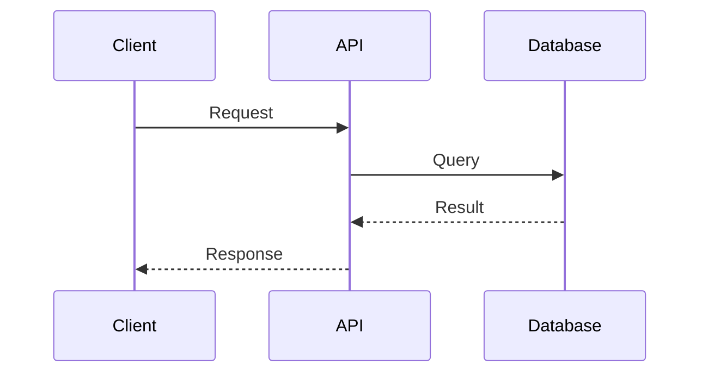
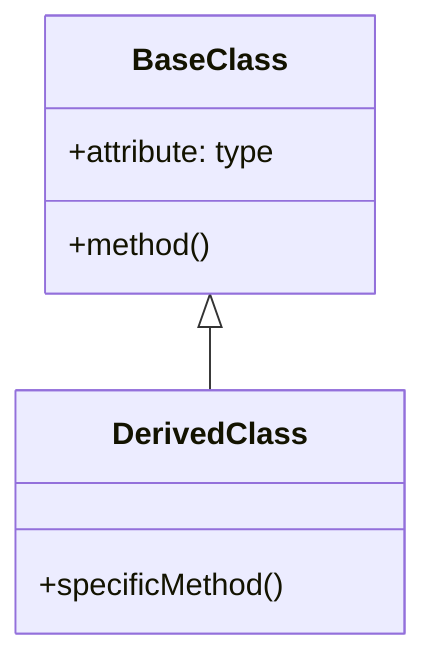
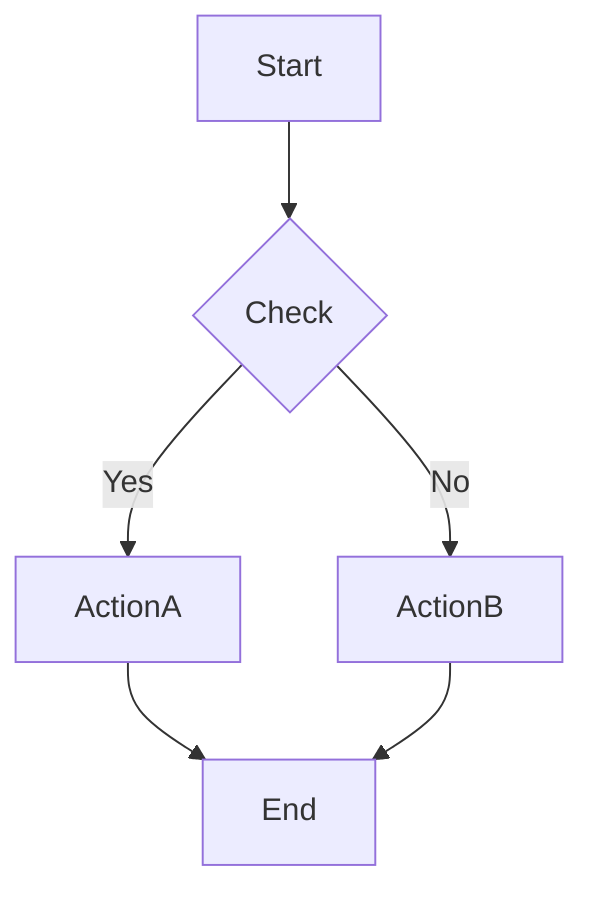
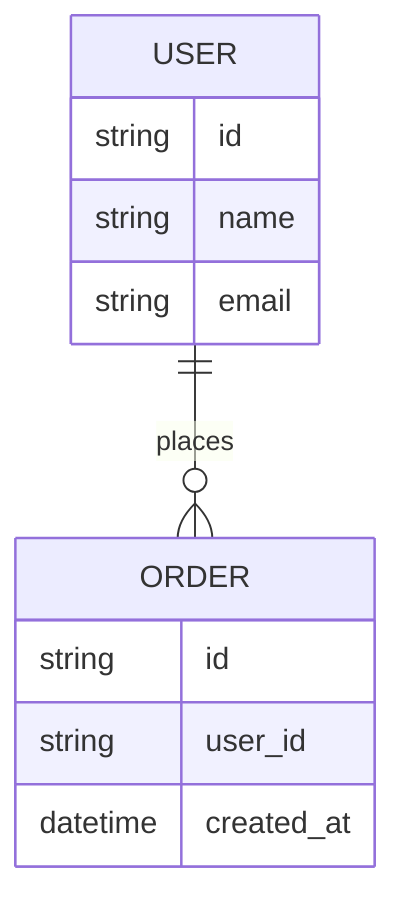
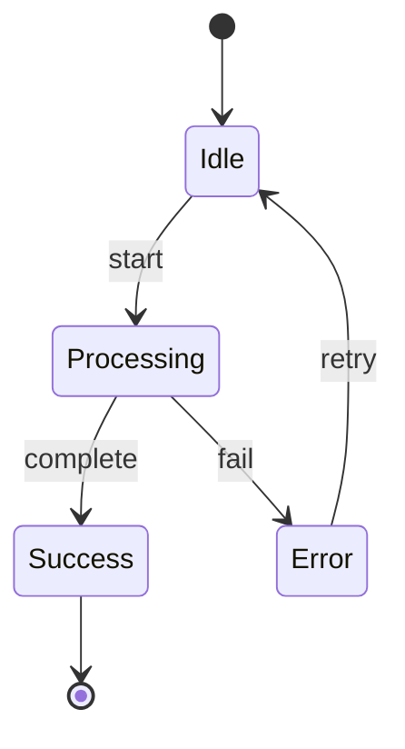

# Template Library

> 문서 템플릿 카탈로그 및 재사용 가능한 패턴

## Overview

다양한 유형의 문서를 빠르게 생성할 수 있는 템플릿 라이브러리입니다.

```
TEMPLATE CATEGORIES:
┌─────────────────────────────────────────────────────────┐
│                 Template Library                         │
│                                                         │
│  Project ─► CLAUDE.md, README.md, CONTRIBUTING.md      │
│             CHANGELOG.md, LICENSE                       │
│                                                         │
│  API ─────► OpenAPI 3.0, Postman Collection            │
│             GraphQL Schema, gRPC Proto                  │
│                                                         │
│  Architecture ─► System Design, Data Model              │
│                  Deployment Guide, ADR                  │
│                                                         │
│  Technical ─► Tutorial, How-to Guide                    │
│               Troubleshooting, FAQ                      │
└─────────────────────────────────────────────────────────┘
```

---

## 프로젝트 문서 템플릿

### CLAUDE.md 템플릿

```markdown
---
name: ${PROJECT_NAME}
description: '${PROJECT_DESCRIPTION}'
category: ${CATEGORY}
---

# ${PROJECT_NAME}

${PROJECT_SUMMARY}

## Core Philosophy

```
${CORE_PRINCIPLES}
```

## Components

| 컴포넌트 | 타입 | 설명 |
|---------|------|------|
${COMPONENT_LIST}

## 빠른 시작

```bash
${QUICK_START_COMMANDS}
```

## 상세 문서

${DETAILED_DOCS_LINKS}

[parent](${PARENT_PATH})
```

### README.md 템플릿

```markdown
# ${PROJECT_NAME}

${BADGE_SECTION}

## 📋 Overview

${PROJECT_DESCRIPTION}

## ✨ Features

${FEATURE_LIST}

## 🚀 Quick Start

### Prerequisites

${PREREQUISITES}

### Installation

```bash
${INSTALLATION_COMMANDS}
```

### Usage

```bash
${USAGE_EXAMPLES}
```

## 📚 Documentation

${DOCUMENTATION_LINKS}

## 🛠️ Development

### Setup

```bash
${DEV_SETUP_COMMANDS}
```

### Testing

```bash
${TEST_COMMANDS}
```

### Building

```bash
${BUILD_COMMANDS}
```

## 🤝 Contributing

${CONTRIBUTING_GUIDE}

## 📄 License

${LICENSE_INFO}

## 👥 Authors

${AUTHOR_INFO}
```

### CONTRIBUTING.md 템플릿

```markdown
# Contributing Guide

## 🌟 Welcome

${WELCOME_MESSAGE}

## 🔧 Development Process

### 1. Fork & Clone

```bash
git fork ${REPO_URL}
git clone ${YOUR_FORK_URL}
cd ${PROJECT_NAME}
```

### 2. Create Branch

```bash
git checkout -b feature/your-feature-name
```

### 3. Make Changes

${CODING_STANDARDS}

### 4. Run Tests

```bash
${TEST_COMMANDS}
```

### 5. Commit

```bash
${COMMIT_CONVENTIONS}
```

### 6. Push & PR

```bash
git push origin feature/your-feature-name
```

Then create a Pull Request on GitHub.

## 📝 Commit Convention

${COMMIT_MESSAGE_FORMAT}

## 🧪 Testing Standards

${TESTING_STANDARDS}

## 📖 Documentation

${DOCUMENTATION_STANDARDS}

## 🐛 Reporting Bugs

${BUG_REPORT_TEMPLATE}

## 💡 Suggesting Features

${FEATURE_REQUEST_TEMPLATE}

## ❓ Questions

${CONTACT_INFO}
```

### CHANGELOG.md 템플릿

```markdown
# Changelog

All notable changes to this project will be documented in this file.

The format is based on [Keep a Changelog](https://keepachangelog.com/en/1.0.0/),
and this project adheres to [Semantic Versioning](https://semver.org/spec/v2.0.0.html).

## [Unreleased]

### Added
- ${NEW_FEATURES}

### Changed
- ${CHANGES}

### Deprecated
- ${DEPRECATIONS}

### Removed
- ${REMOVALS}

### Fixed
- ${BUG_FIXES}

### Security
- ${SECURITY_UPDATES}

## [${VERSION}] - ${DATE}

${RELEASE_NOTES}

[Unreleased]: ${REPO_URL}/compare/v${VERSION}...HEAD
[${VERSION}]: ${REPO_URL}/releases/tag/v${VERSION}
```

---

## API 문서 템플릿

### OpenAPI 3.0 템플릿

```yaml
openapi: 3.0.3
info:
  title: ${API_TITLE}
  description: ${API_DESCRIPTION}
  version: ${API_VERSION}
  contact:
    name: ${CONTACT_NAME}
    email: ${CONTACT_EMAIL}
    url: ${CONTACT_URL}

servers:
  - url: ${SERVER_URL}
    description: ${SERVER_DESCRIPTION}

paths:
  ${API_PATHS}

components:
  schemas:
    ${SCHEMAS}

  securitySchemes:
    ${SECURITY_SCHEMES}

  responses:
    ${COMMON_RESPONSES}

security:
  ${SECURITY_REQUIREMENTS}

tags:
  ${TAGS}
```

### API 사용 가이드 템플릿

```markdown
# ${API_NAME} API Guide

## Authentication

${AUTH_DESCRIPTION}

### Getting API Key

```bash
${API_KEY_GENERATION}
```

### Using API Key

```bash
curl -H "Authorization: Bearer ${API_KEY}" ${API_ENDPOINT}
```

## Endpoints

### ${ENDPOINT_NAME}

**URL**: `${HTTP_METHOD} ${ENDPOINT_PATH}`

**Description**: ${ENDPOINT_DESCRIPTION}

**Request**:

```json
${REQUEST_EXAMPLE}
```

**Response**:

```json
${RESPONSE_EXAMPLE}
```

**Error Codes**:

| Code | Description |
|------|-------------|
${ERROR_CODES}

**Example**:

```bash
${CURL_EXAMPLE}
```

## Rate Limiting

${RATE_LIMIT_INFO}

## Pagination

${PAGINATION_INFO}

## Versioning

${VERSIONING_INFO}
```

### GraphQL Schema 템플릿

```graphql
"""
${SCHEMA_DESCRIPTION}
"""
schema {
  query: Query
  mutation: Mutation
  subscription: Subscription
}

type Query {
  ${QUERY_FIELDS}
}

type Mutation {
  ${MUTATION_FIELDS}
}

type Subscription {
  ${SUBSCRIPTION_FIELDS}
}

${TYPE_DEFINITIONS}

${INPUT_TYPES}

${ENUM_DEFINITIONS}

${INTERFACE_DEFINITIONS}
```

---

## 아키텍처 문서 템플릿

### 시스템 아키텍처 템플릿

```markdown
# System Architecture

## Overview

${SYSTEM_OVERVIEW}

## Architecture Diagram

```mermaid
${ARCHITECTURE_DIAGRAM}
```

## Components

### ${COMPONENT_NAME}

**Purpose**: ${COMPONENT_PURPOSE}

**Technologies**: ${TECHNOLOGIES}

**Responsibilities**:
${RESPONSIBILITIES}

**Interfaces**:
${INTERFACES}

## Data Flow

```mermaid
${DATA_FLOW_DIAGRAM}
```

## Deployment Architecture

```mermaid
${DEPLOYMENT_DIAGRAM}
```

## Technology Stack

| Layer | Technology | Purpose |
|-------|------------|---------|
${TECH_STACK}

## Design Decisions

### ${DECISION_TITLE}

**Status**: ${STATUS}

**Context**: ${CONTEXT}

**Decision**: ${DECISION}

**Consequences**: ${CONSEQUENCES}

## Performance Characteristics

${PERFORMANCE_INFO}

## Security Model

${SECURITY_INFO}

## Scalability

${SCALABILITY_INFO}
```

### ADR (Architecture Decision Record) 템플릿

```markdown
# ADR ${NUMBER}: ${TITLE}

## Status

${STATUS}  <!-- Proposed, Accepted, Deprecated, Superseded -->

## Context

${CONTEXT_DESCRIPTION}

## Decision

${DECISION_DESCRIPTION}

## Consequences

### Positive

${POSITIVE_CONSEQUENCES}

### Negative

${NEGATIVE_CONSEQUENCES}

### Neutral

${NEUTRAL_CONSEQUENCES}

## Alternatives Considered

### ${ALTERNATIVE_1}

${ALTERNATIVE_1_DESCRIPTION}

**Pros**: ${PROS}

**Cons**: ${CONS}

### ${ALTERNATIVE_2}

${ALTERNATIVE_2_DESCRIPTION}

**Pros**: ${PROS}

**Cons**: ${CONS}

## References

${REFERENCES}

## Date

${DATE}
```

### 데이터 모델 템플릿

```markdown
# Data Model

## Entity Relationship Diagram

```mermaid
erDiagram
${ERD_DEFINITION}
```

## Entities

### ${ENTITY_NAME}

**Description**: ${ENTITY_DESCRIPTION}

**Attributes**:

| Column | Type | Constraints | Description |
|--------|------|-------------|-------------|
${ENTITY_ATTRIBUTES}

**Relationships**:

${ENTITY_RELATIONSHIPS}

**Indexes**:

${ENTITY_INDEXES}

**Business Rules**:

${BUSINESS_RULES}

## Data Flow

```mermaid
${DATA_FLOW}
```

## Migrations

### ${MIGRATION_VERSION}

**Purpose**: ${MIGRATION_PURPOSE}

**Changes**:

${MIGRATION_CHANGES}

**Rollback**:

```sql
${ROLLBACK_SQL}
```
```

---

## 기술 문서 템플릿

### 튜토리얼 템플릿

```markdown
# ${TUTORIAL_TITLE}

**Difficulty**: ${DIFFICULTY_LEVEL}

**Time**: ${ESTIMATED_TIME}

## What You'll Build

${TUTORIAL_OVERVIEW}

## Prerequisites

${PREREQUISITES_LIST}

## Step 1: ${STEP_1_TITLE}

${STEP_1_DESCRIPTION}

```${LANGUAGE}
${STEP_1_CODE}
```

**Explanation**:

${STEP_1_EXPLANATION}

## Step 2: ${STEP_2_TITLE}

${STEP_2_DESCRIPTION}

```${LANGUAGE}
${STEP_2_CODE}
```

**Explanation**:

${STEP_2_EXPLANATION}

## Testing

```bash
${TEST_COMMANDS}
```

**Expected Output**:

```
${EXPECTED_OUTPUT}
```

## Next Steps

${NEXT_STEPS}

## Troubleshooting

${TROUBLESHOOTING_TIPS}

## Complete Code

${COMPLETE_CODE_LINK}
```

### How-to 가이드 템플릿

```markdown
# How to ${TASK_TITLE}

## Goal

${TASK_GOAL}

## Prerequisites

${PREREQUISITES}

## Steps

### 1. ${STEP_1}

```${LANGUAGE}
${STEP_1_CODE}
```

### 2. ${STEP_2}

```${LANGUAGE}
${STEP_2_CODE}
```

### 3. ${STEP_3}

```${LANGUAGE}
${STEP_3_CODE}
```

## Verification

```bash
${VERIFICATION_COMMANDS}
```

## Common Issues

### ${ISSUE_1}

**Problem**: ${PROBLEM_DESCRIPTION}

**Solution**: ${SOLUTION}

### ${ISSUE_2}

**Problem**: ${PROBLEM_DESCRIPTION}

**Solution**: ${SOLUTION}

## Best Practices

${BEST_PRACTICES}

## See Also

${RELATED_DOCS}
```

### FAQ 템플릿

```markdown
# Frequently Asked Questions

## General

### ${QUESTION_1}

${ANSWER_1}

### ${QUESTION_2}

${ANSWER_2}

## Installation

### ${INSTALLATION_QUESTION}

${INSTALLATION_ANSWER}

## Usage

### ${USAGE_QUESTION}

${USAGE_ANSWER}

## Troubleshooting

### ${TROUBLESHOOTING_QUESTION}

${TROUBLESHOOTING_ANSWER}

## Configuration

### ${CONFIG_QUESTION}

${CONFIG_ANSWER}

## Performance

### ${PERFORMANCE_QUESTION}

${PERFORMANCE_ANSWER}

## Security

### ${SECURITY_QUESTION}

${SECURITY_ANSWER}

## Didn't find your answer?

${CONTACT_INFO}
```

---

## 다이어그램 템플릿

### Mermaid 다이어그램 패턴

```markdown
### Sequence Diagram



### Class Diagram



### Flowchart



### Entity Relationship



### State Diagram


```

---

## 템플릿 변수 시스템

### 변수 정의

```yaml
# .claude/template-vars.yml
project:
  name: "${PROJECT_NAME}"
  version: "${PROJECT_VERSION}"
  description: "${PROJECT_DESCRIPTION}"
  author: "${AUTHOR_NAME}"
  license: "${LICENSE}"
  repository: "${REPO_URL}"

api:
  base_url: "${API_BASE_URL}"
  version: "${API_VERSION}"
  auth_type: "${AUTH_TYPE}"

documentation:
  style: "mkdocs"  # mkdocs, docusaurus, vuepress
  theme: "material"
  language: "ko"
```

### 변수 사용

```markdown
# ${project.name}

Version: ${project.version}

${project.description}

Author: ${project.author}

License: ${project.license}
```

---

## 자동 생성 설정

### 문서 생성 규칙

```yaml
# .claude/doc-generation.yml
rules:
  # 새 파일 생성 시 자동 문서화
  on_file_create:
    - pattern: "src/**/*.ts"
      action: generate_api_doc

  # 변경 시 업데이트
  on_file_change:
    - pattern: "src/entities/*.ts"
      action: update_data_model

  # 커밋 시 CHANGELOG 업데이트
  on_commit:
    action: update_changelog

  # 릴리스 시 문서 빌드
  on_release:
    - action: generate_docs
    - action: deploy_docs
```

---

**관련 문서**: [CLAUDE.md](../CLAUDE.md) | [code-analysis.md](code-analysis.md) | [progressive-disclosure.md](progressive-disclosure.md)
